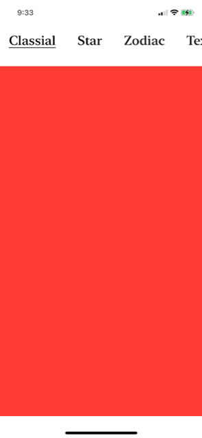

# SwiftUISelector
A perfect option picker. Great for navigation. Simple to use.



<p> Try it out with <a href="https://github.com/fermoya">@fermoya</a>'s package <a href="https://github.com/fermoya/SwiftUIPager">SwiftUIPager</a>!</p>

## Swift Package Manager

SwiftUISelector is available through [Swift Package Manager](https://swift.org/package-manager).

Add it to an existing Xcode project as a package dependency:

1. From the **File** menu, select **Swift Packages › Add Package Dependency…**
2. Enter "https://github.com/p-larson/SwiftUISelector" into the package repository URL text field

**or**

Copy and Paste <a href="https://github.com/fermoya/Sources/SwiftUIPager.swift">SwiftUIPager.swift</a> into your project!

## Features :sparkles:
- Smooth Selection
- User Control
- Dynamic Options
- Simple Animations

## Requirements
- iOS 14, macOS 10.15
- Swift 5.3

## Initialization

Important to note:
```swift
SelectorView<Option, OptionView>: View where Option: Hashable, OptionView: View
```

1. Use Strings for Options (Intended Initializer)
```swift
// SelectorView(selectedOption: Binding<Int>, options: [String])
SelectorView(
    selectedOption: $selectedOption,
    options: ["Classial", "Star", "Zodiac", "Text Art"]
)
```

2. Custom Options and Option View.
(This is to give you a lot of freedom to make the SelectorView fit your needs)

```swift
/*
    SelectorView(
        selectedOption: Binding<Int>, 
        options: [Option], 
        @ViewBuilder content: @escaping (Option) -> OptionView
    )
 **/
SelectorView(selectedOption: $selectedOption, options: [1, 2, 3, 4]) { (option) in
    Text(option.description)
        .italic()
        .padding()
        .background(
            Rectangle()
            .fill(Color.clear)
            .border(Color.black, width: 2)
            .padding(.bottom, 4)
        )
}
.font(
    .system(
        size: 24,
        weight: Font.Weight.black,
        design: Font.Design.monospaced
    )
)
```
